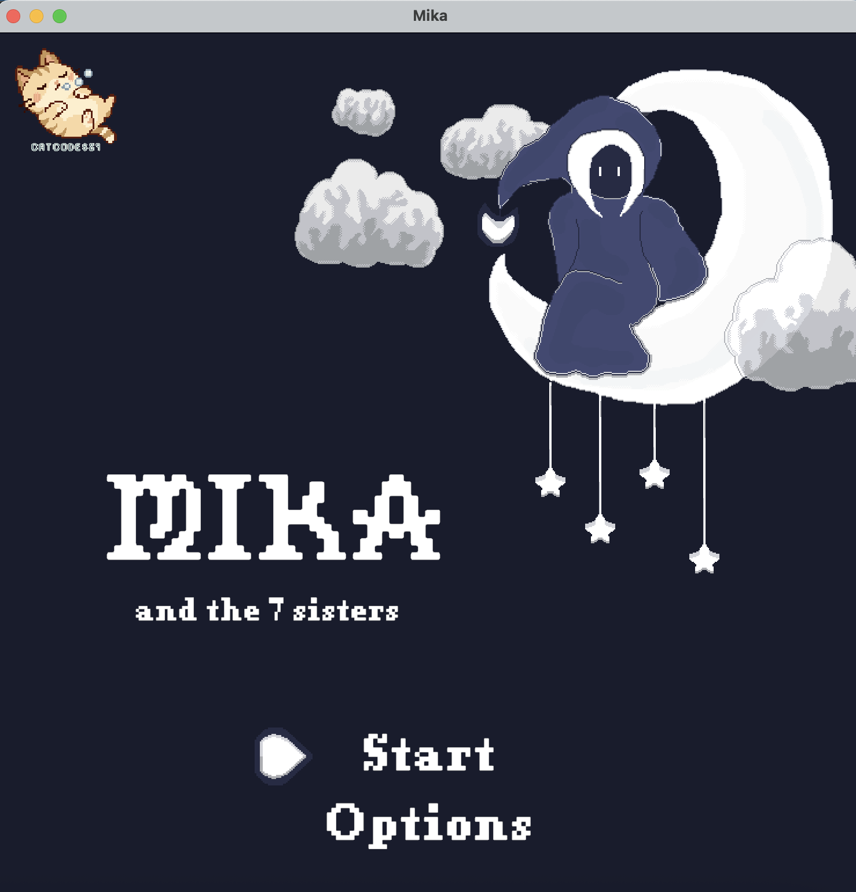

# Mika and the 7 Sisters - UI/UX Sketches

This repo includes mock-up UI sketches and final versions used in the game.

## Main Menu Mock-up

A hand-drawn mock-up showing my vision for the Start Menu UI. It outlines logo placement, animation notes, and sound effects.

## Final In-Game Screenshot

Final version implemented in Unity using pixel art and C#.

---

## Mika's Custom Dialog Box – Pixel UI Design

A fully original pixel UI element created with a restricted color palette. This dialog box was designed to reflect Mika’s mood, tone, and story. Sprite expressions, button layout, and text clarity were carefully crafted for player immersion.

👉 [**View this project on GitHub**](https://github.com/CatCodes89/CatCodes89.github.io)