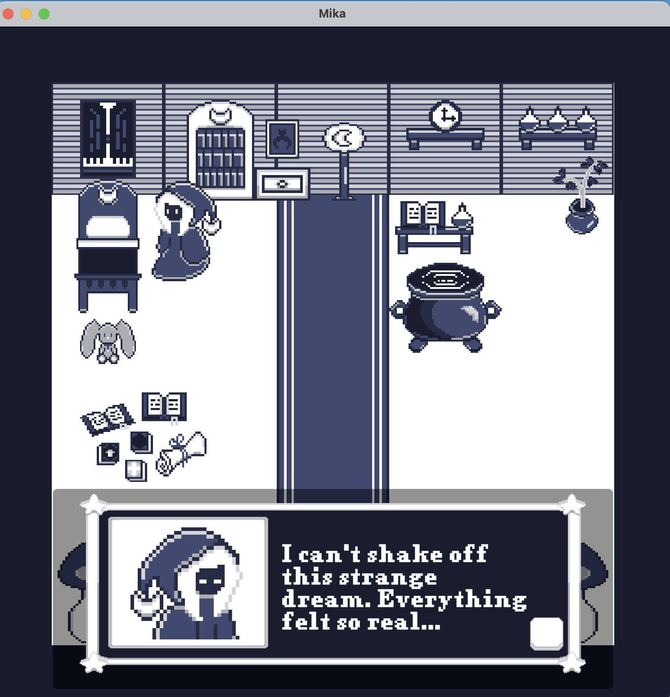

# Mika and the 7 Sisters - UI/UX Sketches

This repo includes mock-up UI sketches and final versions used in the game.

## Main Menu Mock-up

A hand-drawn mock-up showing my vision for the Start Menu UI. It outlines logo placement, animation notes, and sound effects.

## Final In-Game Screenshot

Final version implemented in Unity using pixel art and C#.

---

## Mika's Custom Dialog Box – Pixel UI Design

A fully original pixel UI element created with a restricted color palette. This dialog box was designed to reflect Mika’s mood, tone, and story. Sprite expressions, button layout, and text clarity were carefully crafted for player immersion.

## Mika's Sprite Sheet Animation

🎥 [Watch Animation](assets/MikaSpriteSheet.mp4)

A pixel animation showcasing Mika’s idle and walking cycles. Each frame was carefully crafted at 64×64 pixels to reflect the flow of her robe, sway of her hood charm, and subtle head and arm movement—capturing her personality in motion.

# Mika and the 7 Sisters – UI/UX Sketches

This repo includes UI mock-ups, final UI implementations, and design notes used throughout development.

## 📝 Main Menu Mock-up

A hand-drawn mock-up showing my vision for the Start Menu UI. It outlines logo placement, animation cues, and sound effect ideas for button interactions.

## ✅ Final In-Game Screenshot

This main menu was implemented in Unity using the built-in UI system and C#. The layout was designed with readability in mind, and custom pixel buttons were added for aesthetic consistency.

---

## 💬 Mika's Custom Dialog Box – Pixel UI Design

An original pixel UI element created using a restricted color palette. This dialog box reflects Mika’s personality and story tone. Design decisions focused on:
- Clear font readability
- Expressive sprite portraits
- Balanced button placement for player response time

---

## 🧭 Inventory & Stats Pages – New UI Elements

*These were added as part of the dev blog update.*

Screens and assets showing my implementation of:
- 📦 Inventory system
- 📊 Player stats menu
- ⏸️ Pause menu

These systems were built in Unity using pixel UI sprites, consistent button layout, and animated transitions to improve flow and immersion.

---

## 🧵 Mika’s Sprite Sheet Animation

🎥 [Watch Animation](assets/MikaSpriteSheet.mp4)

A pixel animation showcasing Mika’s idle and walking cycles (64×64 resolution). Every frame was crafted to emphasize small personality details like robe movement, charm sway, and expression.

---